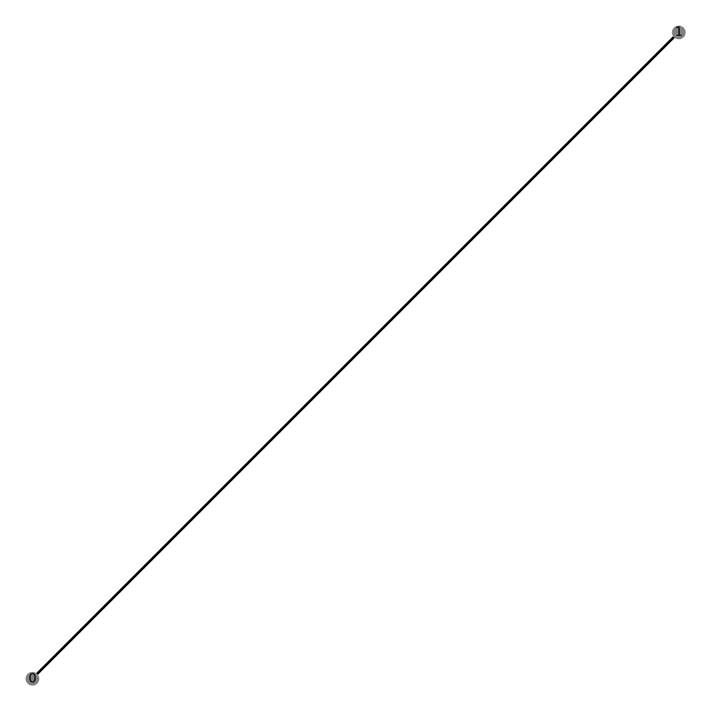

## Fruchterman Reingold Algorithm 

### Aim of this algorithm 
1.	Distribute vertices evenly
2.	Making edge length uniform 
3.	Reflect symmetry 
### Goals
1.	Speed
2.	Simplicity 
### Using Physics for this Algorithm
Spring forces on the ring move the system to a minimal energy state. Attractive forces between neighbours and repulsive forces between every vertex. Eventually, it will seek static equilibrium. 
### Simplified pseudo code
```markdown
For each iteration
1.	Calculate repulsive forces between every vertices  displacement
2.	Calculate attractive forces between neighbour  displacement
3.	Change position according to displacement
```
### Formulas
```markdown
Formula to calculate attraction forces: f(x) = x^2/k
Formula to calculate repulsive forces: f(x) = k^2/x
Optimal distance between vertices: k = C*sqrt(Area/vertices), where c is a constant that is found experimentally. 
```
### Implementation of Fruchterman Reingold Algorithm 
C++ is used to code the algorithm, Graph plotting is code in python using networkx 
There is 2 different ways to initialize the initial position of the nodes on the graph
1.	In a circle with a radius of 1.0

2.	Random initial position bounded by width and length


In addition, it is also different from the Fruchtreman Reingold Algorithm. Even though the initial position of the nodes are bounded by width and length, it is not bounded by width and length when the displacement of the nodes takes places. This means that the nodes can move freely without any boundary. 

#### Limitations of original Fruchterman Reingold algorithm
* O(n^2) complexity to calculate repulsive forces
* If n is big, it will take a very long time
* To improve, barnes hut algorithm is used to improve
## Barnes Hut algorithm 
Instead of calculating the repulsive forces between each node – O(n^2) complexity, Barnes-Hut algorithm group nodes that are sufficiently nearby and thus calculations of force does not need to take place between every single node. 

### Implementation of Barnes Hut algorithm
Data structure used: Quad tree <br/>
The quad tree is implemented by pointers.


There are 2 ways to generate the quad tree
1.	There is a fix frame size, which means nodes cannot go beyond width and length set.
2.	The tree is dynamic, the frame will be determined dynamically by the positions of the nodes

Simplified pseudo code to calculate repulsive forces: 
1.	Generation of quad tree 
2.	Calculate mass & centre of mass
3.	If (s/d < theta) > calculate force , else if (node is leaf) > calculate force, where s is the height of the bounding box and d is the distance between the 2 nodes

To calculate the net force on a particular body, traverse the nodes of the tree, starting from the root. If the center-of-mass of an internal node is sufficiently far from the body, approximate the bodies contained in that part of the tree as a single body, whose position is the group's center of mass and whose mass is the group's total mass. The algorithm is fast because we don't need to individually examine any of the bodies in the group. If the internal node is not sufficiently far from the body, recursively traverse each of its subtrees.

## Graphs
These graphs are mentioned in the original paper and reproduce in this code 

### Complete Graphs
2n | 4n | 6n version 1 | 6n version 2
-- | -- | ------------ | ------------ 
 |  |  | 
7n | 8n | 10n | 12n
 |  |  | 
14n | 16n | 19n | 20n
 |  |  | 
30n | 50n | 100n 
 |  | 

### Cyclic graph
4n | 6n | 7n | 8n
-- | -- | -- | --
 |  |  | 
9n | 10n | 20n | 100n
 |  |  | 
256n 


### Figures in paper
Figure 9 | Figure 19 | Figure 20 
-- | -- | -- 
 |  | 
Figure 30.1 | Figure 30.2 | Figure 30.3
 |  | 
Figure 31 | Figure 40 | Figure 41
 |  | 
Figure 46 | Figure 47 | Figure 51
 |  | 
Figure 73 | Figure 74 
 | 

### Process of Figure 9
Iteration 0 | Iteration 1 | Iteration 2 | Iteration 3 | Iteration 4 | Iteration 5
----------- | ----------- | ----------- | ----------- | ----------- | -----------
 |  | |  |  | 

### 3d graphs
3d graphs can be found in [`graphs_from_paper/output/3d_figure/`](https://github.com/lsscecilia/GraphVisualisation/tree/main/graphs_from_paper/output/3d_figure) in .html format
